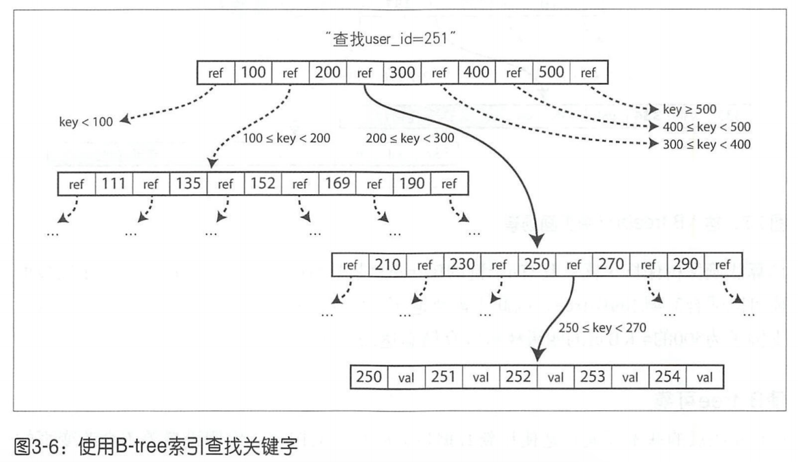

&emsp;&emsp;从最基本的层面看,数据库只需要做两件事情:向它插入数据时,它就保存数据;之后查询时,它应该返回那些数据。与传统数据相比出现了redis之类的内存数据库,与直觉相反内存数据的性能优势并不是因为它们不需要从磁盘读取。如果有足够的内存，即使是基于磁盘的存储引擎，也可能永远不需要从磁盘读取，因为操作系统将最近使用的磁盘块缓存在内存中。相反，内存数据库可以更快，是因为它们避免使用写磁盘格式对内存数据结构编码的开销。  
&emsp;&emsp;这里要探讨的是如何存储输入的数据，并在接收到查询请求时怎样重新找到数据  
## 索引  
&emsp;&emsp;数据库的核心功能就是存储和查询,一个最简单的数据库:有两个函数db_set(key,value),db_get(key),如果数据库中存储了大量的记录,db_get的性能就会很差,开销是O(N),N很大则每次都要全表扫描。  
&emsp;&emsp;为了高效的查找数据库中特定键的值，需要新的数据结构：索引,索引的结构有很多种,它们背后的基本想法都是保留一些额外的元数据,这些元数据作为路标,帮助定位想要的数据。  
索引是基于原始数据派生而来的额外数据结构。很多数据库允许单独添加和删除索引，而不影响数据库内容，它只会影响查询性能。维护额外的结构势必会引入开销，特别是在新数据写入时。对于写入，它很难超过简单地追加文件方式的性能，因为那已经是最简单的写操作了。由于每次写数据时需要更新索引，因此任何类型的索引通常都会降低写的速度。  
&emsp;&emsp;其实这里涉及存储系统中重要的权衡设计:适当的索引可以加速读取查询，但每个索引都会减慢写速度。因此默认情况下，数据库通常不会对所有内容进行索引，需要后期开发人员手动选择索引。为的是给程序提供最有利的加速同时，避免银过多不必要的开销。
### 哈希索引  
&emsp;&emsp;key-value存储于大多数编程语言内置的字典结构非常相似,通常采用hash map来实现，也就是说当在文件中追加新的key-value对时,还要更新hash map来反映刚刚写入数据的偏移量(包括插入新的键和更新已有的键)。当查找某个值时，使用hash map来找到文件中的偏移量，即存储位置，然后读取其内容，这也是Bitcask所采用的核心做法。   
哈希表索引也有其局限性:
- 哈希表必须全部放入内存,所以如果有大量的键,就没那么幸运了。原则上可以在磁盘上维护hash map,但不幸的是,很难使磁盘上的hash map表现良好。它需要大量的随机访问I/O,当哈希变满时,继续增长代价昂贵,并且哈希冲突时需要复杂的处理逻辑。
- 区间查询效率不高。例如，不能简单地支持扫描kitty000000和kitty999999区间内的所有键,只能采用逐个查找的方式查询每一个键。  
### B-Tree
&emsp;&emsp;时至今日它仍然是几乎所有关系数据库的标准索引实现，许多非关系型数据库也经常使用。之前看到的日志结构索引将数据库分解为可变大小的段，通常大小为几兆字节或更大，并且始终按照顺序写入段。相比之下，B-Tree将数据分解成固定大小的块或页，传统上大小为4KB(有时更大)，页是内部读/写的最小单元，这种设计更接近底层硬件，因为磁盘也是以固定大小的块排列，每个页面都可以使用地址或位置进行标识，这样可以让一个页面引用另一个页面，类似指针，不过时指向磁盘地址，而不是内存。可以使用这些页面引用来构造一个树状页面  
  
该算法确保数保持平衡：具有n个键的B-tree总是具有$O(logn)$的深度。大多数数据库可以适合3-4层的B-tree,因此不需要遍历非常深的页面层次即可找到所需的页(分支因子为500的4KB页的四级树可以存储高达256TB)。  
&emsp;&emsp;B-Tree底层的基本写操作是使用新数据覆盖磁盘上的旧页。它假设覆盖不会改变页的磁盘存储位置，也就是说，当页被覆盖时，对该页的所有引用保持不变。  
&emsp;&emsp;B-Tree的优点则是每个键都恰好唯一对应于索引中的某个位置,而日志结构的存储引擎可能在不同的段中具有相同的键的多个副本。如果数据库希望提供强大的事务语义，这方面B-Tree显得更具有吸引力：在许多关系数据库中，事务隔离是通过键范围上锁来实现的，冰企鹅额在B-Tree索引中，这些锁可以直接定义到树种。